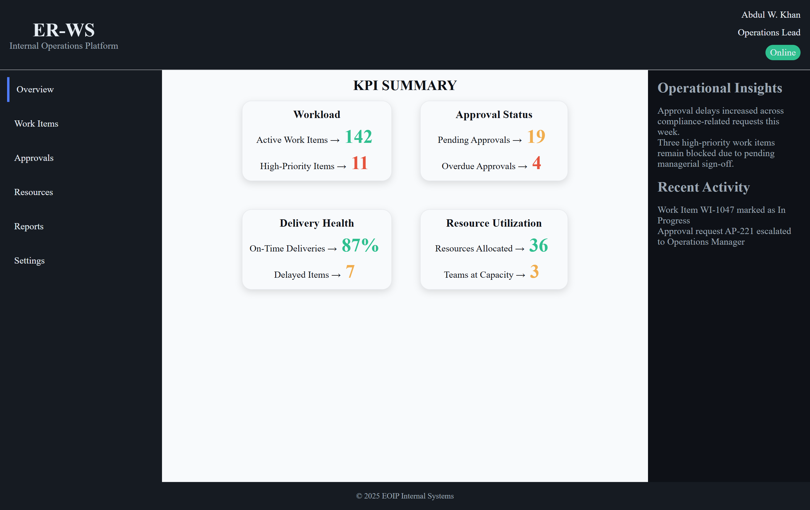

# ER-WS — Internal Operations Dashboard

A modern, dark-theme internal operations dashboard designed to summarize KPIs, approvals, resources, and activity in a clean and organized layout.

---

## 🚀 Live Demo

View on GitHub Pages:

👉 https://waheedkhan10001.github.io/eoip/

(Replace with your actual GitHub Pages link.)

---

## 📸 Screenshot

Add your screenshot inside the project (for example: `assets/screenshot.png`) and update this link:

---

## 🗂 Project Structure

This project is intentionally simple and lightweight — built with pure HTML and CSS.

.
├── index.html → main application UI
├── style.css → layout + component styles
├── token.css → design tokens (colors, spacing, typography)
├── README.md
└── LICENSE

Key files:

- `index.html` — dashboard skeleton and content  
  :contentReference[oaicite:0]{index=0}

- `README.md` (existing placeholder)  
  :contentReference[oaicite:1]{index=1}

- `style.css` — layout, grid, cards, sidebar styling  
  :contentReference[oaicite:2]{index=2}

- `token.css` — theme variables (colors, typography, spacings)  
  :contentReference[oaicite:3]{index=3}

---

## ✨ Features

- Dark UI with modern dashboard layout
- KPI cards with status colors
- Sidebar navigation
- Insights + recent activity sections
- Fully responsive base structure
- No frameworks — easy to extend

---

## 🛠 How to Run Locally

1. Download or clone the repository
2. Open `index.html` in your browser

No build tools — no dependencies — just open and use.

---

## 📄 License

This project is licensed under the **MIT License**.

See the full license here:

➡️ [LICENSE](./LICENSE)

---

## 🤝 Contributing

Feel free to open issues or submit pull requests if you’d like to improve UI, add components, or extend functionality.

---

## ⭐ Support

If you find this useful, please star the repo — it helps a lot!
